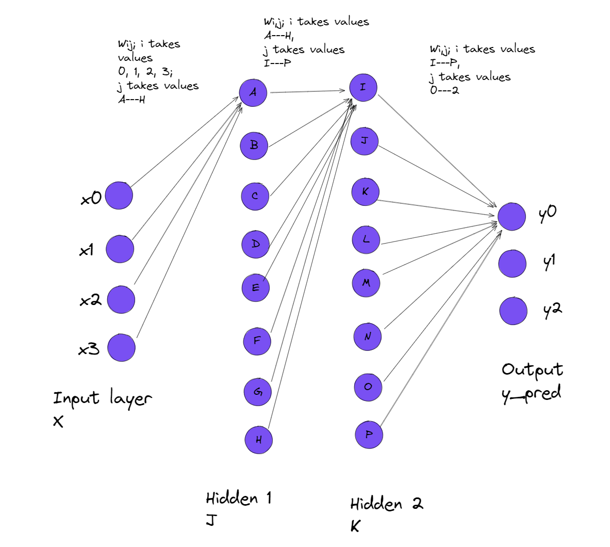

# A N N
 ANN in python without using any Neural Network Libraries

## Introduction
This is a simple implementation of an Artificial Neural Network in python without using any Neural Network Libraries. The code is written in a way that it is easy to understand and can be used as a reference for understanding the working of a neural network.

## Motivation
I've been learning about Neural Networks again in Image Processing, thought I would do something I've always wanted to do, to explore the mathemathics behind the Neural Networks and implement it from scratch. Well, not scratch, I have used NumPy for matrix operations.

## Screenshots

## TODO
- [x] Implement a simple Neural Network
- [ ] Improve the Neural Network
- [ ] Add more features